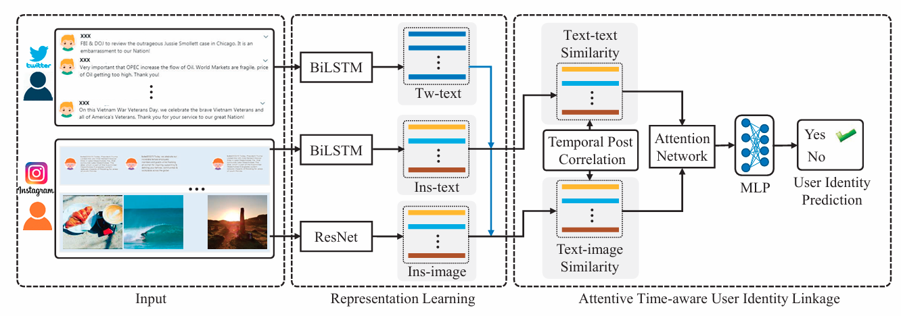

# User Identity Linkage across Social Media via Attentive Time-aware User Modeling

> [IEEE TMM 2021] Official implementation of UserNet, an attentive time-aware framework for user identity linkage across social media platforms.

## Authors

**Xiaolin Chen**<sup>1</sup>, **Xuemeng Song**<sup>1</sup>\*, **Siwei Cui**<sup>2</sup>, **Tian Gan**<sup>1</sup>, **Zhiyong Cheng**<sup>3</sup>, **Liqiang Nie**<sup>1</sup>

<sup>1</sup> Shandong University, Shandong, China  
<sup>2</sup> Texas A&M University, USA  
<sup>3</sup> Qilu University of Technology (Shandong Academy of Sciences), China  
\* Corresponding author

## Links

- **Paper**: [IEEE Xplore](https://ieeexplore.ieee.org/document/9246515)
- **Testing Dataset**: [Google Drive](https://drive.google.com/drive/folders/1ZPyST2mzwS_X6iegCkwUJm2T3tc5p-Yf?usp=sharing)
- **Training Dataset & Feature**: [Baidu Netdisk](https://pan.baidu.com/s/1gqv1HJ1hs4VW_qm6AQggsA) (Password: `yw9f`)

---

## Table of Contents

- [Updates](#updates)
- [Introduction](#introduction)
- [Highlights](#highlights)
- [Method / Framework](#method--framework)
- [Project Structure](#project-structure)
- [Installation](#installation)
- [Dataset](#dataset)
- [Usage](#usage)
- [Citation](#citation)
- [Acknowledgement](#acknowledgement)
- [License](#license)

---

## Updates

- [07/2019] Initial release of UserNet implementation
- [11/2020] Paper accepted at IEEE Transactions on Multimedia (TMM)

---

## Introduction

This repository is the official implementation of the paper **"User Identity Linkage across Social Media via Attentive Time-aware User Modeling"**, published in IEEE Transactions on Multimedia (TMM), 2021.

User identity linkage, which aims to identify accounts belonging to the same real-world entity across different social networks, is an increasingly important task. Existing methods generally overlook the temporal correlations among a user's posts. To address this issue, we propose **UserNet**, an attentive time-aware user modeling framework. UserNet captures the temporal patterns of users' posting behaviors and models the semantic correlations among multi-modal posts with an attention mechanism, thereby learning more discriminative user representations for identity linkage. We also release a large-scale multimodal dataset collected from Twitter and Foursquare to facilitate future research.

---

## Highlights

- Proposes an attentive time-aware user modeling approach for user identity linkage
- Models temporal correlations among a user's multi-modal posts for more discriminative representations
- Designs attention mechanisms to capture semantic correlations across different modalities
- Releases a large-scale multimodal dataset from Twitter and Foursquare
- Achieves state-of-the-art performance on user identity linkage benchmarks

---

## Method / Framework



**Figure 1.** Overall framework of UserNet. The model captures temporal posting patterns and multi-modal semantic correlations via attentive time-aware user modeling.

---

## Project Structure

```text
.
├── assets/                # Figures and framework diagrams
├── Dataset                # Dataset description
├── Time-M2M-Thread.py     # Main entry point for training and evaluation
├── att_lstm.py            # Attention-based LSTM module
├── attention.py           # Attention mechanism
├── lstm.py                # LSTM module
├── similarity.py          # Similarity computation
├── framework.png          # Framework figure
├── README.md
└── ...
```

---

## Installation

### 1. Clone the repository

```bash
git clone https://github.com/iLearn-Lab/UserIdentityLinkage-UserNet.git
cd UserIdentityLinkage-UserNet
```

### 2. Prerequisite

- Python 3.5.2
- TensorFlow 1.9.0
- NumPy 1.16.4

### 3. Install dependencies

```bash
pip install numpy==1.16.4 tensorflow==1.9.0
```

---

## Dataset

We provide a large-scale multimodal dataset collected from Twitter and Foursquare for user identity linkage research.

- **Testing Dataset**: [Google Drive](https://drive.google.com/drive/folders/1ZPyST2mzwS_X6iegCkwUJm2T3tc5p-Yf?usp=sharing)
- **Training Dataset & Feature**: [Baidu Netdisk](https://pan.baidu.com/s/1gqv1HJ1hs4VW_qm6AQggsA) (Password: `yw9f`)

After downloading, please place the data files in the project directory and ensure the paths are configured correctly.

---

## Usage

### Training and Evaluation

```bash
python Time-M2M-Thread.py
```

---

## Citation

If you find this work useful for your research, please cite our paper:

```bibtex
@article{chen2021usernet,
  title={User Identity Linkage Across Social Media via Attentive Time-Aware User Modeling},
  author={Chen, Xiaolin and Song, Xuemeng and Cui, Siwei and Gan, Tian and Cheng, Zhiyong and Nie, Liqiang},
  journal={IEEE Transactions on Multimedia},
  volume={23},
  pages={3957--3967},
  year={2021},
}
```

---

## Acknowledgement

- Thanks to our supervisor and collaborators for valuable support.
- Thanks to the open-source community for providing useful baselines and tools.

---

## License

This project is released under the Apache License 2.0.
